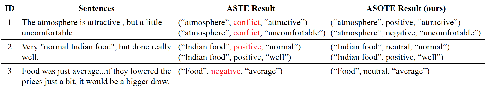

# The code and data for the paper "[A More Fine-Grained Aspect-Sentiment-Opinion Triplet Extraction Task](https://arxiv.org/pdf/2103.15255.pdf)"

# ASOTE
Aspect-Sentiment-Opinion Triplet Extraction (ASOTE) extracts aspect term, sentiment and opinion term triplets from sentences. In the triplet extracted by ASOTE the sentiment is the sentiment of the aspect term and opinion term pair. For example, given the sentence, "The atmosphere is attractive , but a little uncomfortable.", ASOTE extracts two triplets, ("atmosphere", positive, "attractive") and ("atmosphere", negative, "uncomfortable").

# Differences between ASOTE and ASTE
Aspect Sentiment Triplet Extraction (ASTE) ([Knowing What, How and Why: A Near Complete Solution for Aspect-based Sentiment Analysis](https://arxiv.org/abs/1911.01616)) also extracts triplets from sentences. Each triplet extracted by ASTE contains an aspect term, <u>the sentiment that the sentence expresses toward the aspect term</u>, and one opinion term associated with the aspect.


In the third sentence, the negative sentiment toward the aspect term “food” isexpressed without an annotatable opinion.

A few models have been proposed to extract opinion triplets from sentences. However, these models were only evaluated on the ASTE task  and we will evaluate their performances on the ASOTE task.
- [Position-Aware Tagging for Aspect Sentiment Triplet Extraction](https://arxiv.org/pdf/2010.02609.pdf). Lu Xu, Hao Li, Wei Lu, Lidong Bing. In EMNLP, 2020. [original_repository](https://github.com/xuuuluuu/Position-Aware-Tagging-for-ASTE) [ Position-Aware-Tagging_on_ASOTE](https://github.com/l294265421/Position-Aware-Tagging-for-ASOTE)
- [Grid Tagging Scheme for Aspect-oriented Fine-grained Opinion Extraction](https://arxiv.org/pdf/2010.04640.pdf). Zhen Wu, Chengcan Ying, Fei Zhao, Zhifang Fan, Xinyu Dai, Rui Xia. In Findings of EMNLP, 2020. [original_repository](https://github.com/NJUNLP/GTS) [GTS_on_ASOTE](https://github.com/l294265421/GTS-ASOTE)
- [A Multi-task Learning Framework for Opinion Triplet Extraction](https://arxiv.org/abs/2010.01512). Chen Zhang, Qiuchi Li, Dawei Song, Benyou Wang. In Findings of EMNLP, 2020. [original_repository](https://github.com/GeneZC/OTE-MTL) [OTE-MTL_on_ASOTE](https://github.com/l294265421/OTE-MTL-ASOTE)
- more models...

# Data
We build four datasets for the ASOTE task: [14res](ASOTE-data/absa/ASOTE/rest14), [14lap](ASOTE-data/absa/ASOTE/lapt14), [15res](ASOTE-data/absa/ASOTE/rest15), [16res](ASOTE-data/absa/ASOTE/rest16). 

Specifically, we first construct four ASTE datasets by merging four ATSA datasets from three SemEval tasks ([SemEval-2014 Task 4](https://alt.qcri.org/semeval2014/task4/), [SemEval-2015 Task 12](https://alt.qcri.org/semeval2015/task12/), [SemEval-2016 Task 5](https://alt.qcri.org/semeval2016/task5/)) and four [TOWE datasets](https://www.aclweb.org/anthology/N19-1259.pdf) like [Knowing What, How and Why: A Near Complete Solution for Aspect-based Sentiment Analysis](https://arxiv.org/abs/1911.01616), then manually annotate the sentiment of the aspect and opinion pair in the ASTE datasets. 

For example, given the sentence, "The atmosphere is attractive, but a little uncomfortable.", its annotations in [SemEval-2014 Task 4](https://alt.qcri.org/semeval2014/task4/) are as follows:
```xml
<sentence id="32464601#418474#1">
    <text>The atmosphere is attractive, but a little uncomfortable.</text>
    <aspectTerms>
        <aspectTerm term="atmosphere" polarity="conflict"  from="4" to="14"/>
    </aspectTerms>
</sentence>
```
its annotations in [TOWE datasets](https://www.aclweb.org/anthology/N19-1259.pdf) are as follows:
```text
32464601#418474#1	The atmosphere is attractive , but a little uncomfortable .	The\O atmosphere\B is\O attractive\O ,\O but\O a\O little\O uncomfortable\O .\O	The\O atmosphere\O is\O attractive\B ,\O but\O a\O little\O uncomfortable\B .\O

```

We align the above annotations of the sentence and get an ASTE sample:
```json
{
    "sentence": "The atmosphere is attractive , but a little uncomfortable .", 
    "words": [
        "The", 
        "atmosphere", 
        "is", 
        "attractive", 
        ",", 
        "but", 
        "a", 
        "little", 
        "uncomfortable", 
        "."
    ], 
    "polarity": "conflict", 
    "opinions": [
        {
            "aspect_term": {
                "start": 1, 
                "end": 2, 
                "term": "atmosphere"
            }, 
            "opinion_term": {
                "start": 3, 
                "end": 4, 
                "term": "attractive"
            }
        }, 
        {
            "aspect_term": {
                "start": 1, 
                "end": 2, 
                "term": "atmosphere"
            }, 
            "opinion_term": {
                "start": 8, 
                "end": 9, 
                "term": "uncomfortable"
            }
        }
    ], 
    "aspect_term": {
        "start": 1, 
        "end": 2, 
        "term": "atmosphere"
    }
}
```

We then annotate the sentiments of the aspect term and opinion term pairs in the ASTE sample and get an ASOTE sample:
```json
{
    "sentence": "The atmosphere is attractive , but a little uncomfortable .", 
    "words": [
        "The", 
        "atmosphere", 
        "is", 
        "attractive", 
        ",", 
        "but", 
        "a", 
        "little", 
        "uncomfortable", 
        "."
    ], 
    "polarity": "conflict", 
    "opinions": [
        {
            "aspect_term": {
                "start": 1, 
                "end": 2, 
                "term": "atmosphere"
            }, 
            "opinion_term": {
                "start": 3, 
                "end": 4, 
                "term": "attractive"
            }, 
            "polarity": "positive"
        }, 
        {
            "aspect_term": {
                "start": 1, 
                "end": 2, 
                "term": "atmosphere"
            }, 
            "opinion_term": {
                "start": 8, 
                "end": 9, 
                "term": "uncomfortable"
            }, 
            "polarity": "negative"
        }
    ], 
    "aspect_term": {
        "start": 1, 
        "end": 2, 
        "term": "atmosphere"
    }
}
```

Note that, in our ASOTE datasets, triplets belonging to different aspect terms in the same sentence are in different json lines.

# Requirements
- Python 3.6.8
- torch==1.2.0
- pytorch-transformers==1.1.0
- allennlp==0.9.0

# Instructions:
Before excuting the following commands, replace glove.840B.300d.txt(http://nlp.stanford.edu/data/wordvecs/glove.840B.300d.zip), bert-base-uncased.tar.gz(https://s3.amazonaws.com/models.huggingface.co/bert/bert-base-uncased.tar.gz) and vocab.txt(https://s3.amazonaws.com/models.huggingface.co/bert/bert-base-uncased-vocab.txt) with the corresponding absolute paths in your computer. 

# ATE
scripts/ate.sh

# TOWE
scripts/towe.sh

# TOWE inference
scripts/towe.predic.sh

# AOSC
scripts/tosc.sh

# U-ASO
scripts/towe_tosc_jointly.sh

# U-ASO inference
scripts/towe_tosc_jointly.predict.sh

# MIL-ASO
scripts/mil_aso.sh

# MIL-ASO inference
scripts/mil_aso.predict.sh

# evaluate
scripts/evaluate.sh
