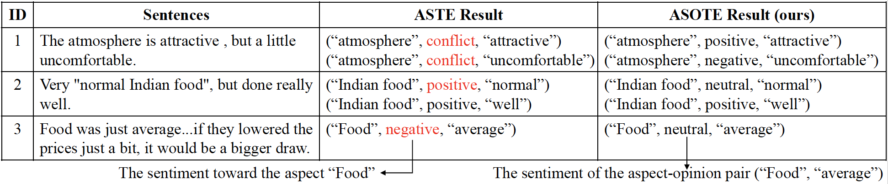
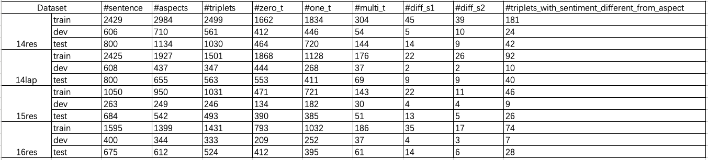
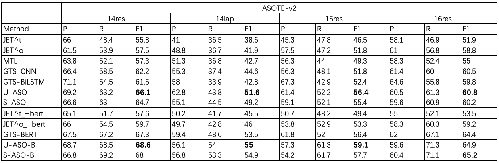

# The code and data for the paper "[A More Fine-Grained Aspect-Sentiment-Opinion Triplet Extraction Task](https://arxiv.org/pdf/2103.15255.pdf)"

# ASOTE
Aspect-Sentiment-Opinion Triplet Extraction (ASOTE) extracts aspect term, sentiment and opinion term triplets from sentences. In the triplet extracted by ASOTE the sentiment is the sentiment of the aspect term and opinion term pair. For example, given the sentence, "The atmosphere is attractive , but a little uncomfortable.", ASOTE extracts two triplets, ("atmosphere", positive, "attractive") and ("atmosphere", negative, "uncomfortable").

# Differences between ASOTE and ASTE
Aspect Sentiment Triplet Extraction (ASTE) ([Knowing What, How and Why: A Near Complete Solution for Aspect-based Sentiment Analysis](https://arxiv.org/abs/1911.01616)) also extracts triplets from sentences. Each triplet extracted by ASTE contains an aspect term, <u>the sentiment that the sentence expresses toward the aspect term</u>, and one opinion term associated with the aspect. For example,


More examples are as follows:

In the third sentence, the negative sentiment toward the aspect term “food” is expressed without an annotatable opinion.

# Data
## Dataset Construction
We build four datasets for the ASOTE task: 14res, 14lap, 15res, 16res. 

Specifically, we first construct four ASTE datasets by merging four ATSA datasets from three SemEval tasks ([SemEval-2014 Task 4](https://alt.qcri.org/semeval2014/task4/), [SemEval-2015 Task 12](https://alt.qcri.org/semeval2015/task12/), [SemEval-2016 Task 5](https://alt.qcri.org/semeval2016/task5/)) and four [TOWE datasets](https://www.aclweb.org/anthology/N19-1259.pdf) like [Knowing What, How and Why: A Near Complete Solution for Aspect-based Sentiment Analysis](https://arxiv.org/abs/1911.01616), then manually annotate the sentiment of the aspect and opinion pair in the ASTE datasets. 

For example, given the sentence, "The atmosphere is attractive, but a little uncomfortable.", its annotations in [SemEval-2014 Task 4](https://alt.qcri.org/semeval2014/task4/) are as follows:
```xml
<sentence id="32464601#418474#1">
    <text>The atmosphere is attractive, but a little uncomfortable.</text>
    <aspectTerms>
        <aspectTerm term="atmosphere" polarity="conflict"  from="4" to="14"/>
    </aspectTerms>
</sentence>
```
its annotations in [TOWE datasets](https://www.aclweb.org/anthology/N19-1259.pdf) are as follows:
```text
32464601#418474#1	The atmosphere is attractive , but a little uncomfortable .	The\O atmosphere\B is\O attractive\O ,\O but\O a\O little\O uncomfortable\O .\O	The\O atmosphere\O is\O attractive\B ,\O but\O a\O little\O uncomfortable\B .\O

```

We align the above annotations of the sentence and get an ASTE sample:
```json
{
    "sentence": "The atmosphere is attractive , but a little uncomfortable .", 
    "words": [
        "The", 
        "atmosphere", 
        "is", 
        "attractive", 
        ",", 
        "but", 
        "a", 
        "little", 
        "uncomfortable", 
        "."
    ], 
    "polarity": "conflict", 
    "opinions": [
        {
            "aspect_term": {
                "start": 1, 
                "end": 2, 
                "term": "atmosphere"
            }, 
            "opinion_term": {
                "start": 3, 
                "end": 4, 
                "term": "attractive"
            }
        }, 
        {
            "aspect_term": {
                "start": 1, 
                "end": 2, 
                "term": "atmosphere"
            }, 
            "opinion_term": {
                "start": 8, 
                "end": 9, 
                "term": "uncomfortable"
            }
        }
    ], 
    "aspect_term": {
        "start": 1, 
        "end": 2, 
        "term": "atmosphere"
    }
}
```

We then annotate the sentiments of the aspect term and opinion term pairs in the ASTE sample and get an ASOTE sample:
```json
{
    "sentence": "The atmosphere is attractive , but a little uncomfortable .", 
    "words": [
        "The", 
        "atmosphere", 
        "is", 
        "attractive", 
        ",", 
        "but", 
        "a", 
        "little", 
        "uncomfortable", 
        "."
    ], 
    "polarity": "conflict", 
    "opinions": [
        {
            "aspect_term": {
                "start": 1, 
                "end": 2, 
                "term": "atmosphere"
            }, 
            "opinion_term": {
                "start": 3, 
                "end": 4, 
                "term": "attractive"
            }, 
            "polarity": "positive"
        }, 
        {
            "aspect_term": {
                "start": 1, 
                "end": 2, 
                "term": "atmosphere"
            }, 
            "opinion_term": {
                "start": 8, 
                "end": 9, 
                "term": "uncomfortable"
            }, 
            "polarity": "negative"
        }
    ], 
    "aspect_term": {
        "start": 1, 
        "end": 2, 
        "term": "atmosphere"
    }
}
```

Note that, in our ASOTE datasets, triplets belonging to different aspect terms in the same sentence are in different json lines.

## Data version
### v1
[14res](ASOTE-data/absa/ASOTE/rest14), [14lap](ASOTE-data/absa/ASOTE/lapt14), [15res](ASOTE-data/absa/ASOTE/rest15), [16res](ASOTE-data/absa/ASOTE/rest16)

The v1 datasets only includes sentences which contain at least one aspect term.

### v2
[14res](ASOTE-data/absa/ASOTE-v2/rest14), [14lap](ASOTE-data/absa/ASOTE-v2/lapt14), [15res](ASOTE-data/absa/ASOTE-v2/rest15), [16res](ASOTE-data/absa/ASOTE-v2/rest16)

The v2 datasets includes both sentences which contain aspect terms and sentences which do not contain aspect terms. That is, the v2 datasets include all sentences in the corresponding ATSA datasets from the three SemEval tasks ([SemEval-2014 Task 4](https://alt.qcri.org/semeval2014/task4/), [SemEval-2015 Task 12](https://alt.qcri.org/semeval2015/task12/), [SemEval-2016 Task 5](https://alt.qcri.org/semeval2016/task5/)). For example, although the sentence, "It gets very crowded so I would suggest that you get their early .", do not contain aspect terms, it also is included in the v2 datasets. We think datasets including these sentences can better evaluate the performance of methods, since methods can encounter this kind of sentences in real-world scenarios. The statistcs of the v2 datasets are as follows:

\#zero\_t, \#one\_t and \#multi\_t represent the number of aspects without triplet, with one triplet and with multiple triplets, respectively. \#diff\_s1 represents the number of aspects that have multiple triplets with different sentiments. \#diff\_s2 represents the number of aspects which only have one triplet and whose sentiments are not conflict and are different from the sentiment of the corresponding triplet. #triplets_with_sentiment_different_from_aspect represents the number of triplets whose sentiments are different from the sentiments of the aspect terms in them.

## Is it necessary to annotate the sentiments of the aspect term and opinion term pairs in the ASTE datasets for obtaining our ASOTE datasets?
Wang et al. ([2016](https://www.aclweb.org/anthology/D16-1059.pdf), [2017](https://www.aaai.org/Conferences/AAAI/2017/PreliminaryPapers/15-Wang-W-14441.pdf)) have annotated the opinions and thier sentiments of the sentences in the restaurant and laptop datasets from [SemEval-2014 Task 4](https://alt.qcri.org/semeval2014/task4/) and the restaurant dataset from [SemEval-2015 Task 12](https://alt.qcri.org/semeval2015/task12/). Is it necessary to annotate the sentiments of the aspect term and opinion term pairs in the ASTE datasets for obtaining our ASOTE datasets? The answer is yes. The reasons are as follows:
- The sentiments of aspect term and opinion term pairs are different from the sentiments of opinions.
- Wang et al. ([2016](https://www.aclweb.org/anthology/D16-1059.pdf), [2017](https://www.aaai.org/Conferences/AAAI/2017/PreliminaryPapers/15-Wang-W-14441.pdf)) only annotated the opinions with positive sentiments or negative sentiments. That is, the opinions with neutral sentiments were not annotated. 
- The opinions annotated by Wang et al. ([2016](https://www.aclweb.org/anthology/D16-1059.pdf), [2017](https://www.aaai.org/Conferences/AAAI/2017/PreliminaryPapers/15-Wang-W-14441.pdf)) are different from the opinions annotated in the [TOWE datasets](https://www.aclweb.org/anthology/N19-1259.pdf) which are used to construct our ASOTE datasets. For example, given this sentence, "those rolls were big , but not good and sashimi wasn't fresh.", the opinions and their sentiments annotated by Wang et al. ([2016](https://www.aclweb.org/anthology/D16-1059.pdf), [2017](https://www.aaai.org/Conferences/AAAI/2017/PreliminaryPapers/15-Wang-W-14441.pdf)) are big +1, good +1, and fresh +1 (+1 indicates positive sentiment), while the opinions annotated in the [TOWE datasets](https://www.aclweb.org/anthology/N19-1259.pdf) are "big", "not good" and "wasn't fresh". We think the opinions annotated in the [TOWE datasets](https://www.aclweb.org/anthology/N19-1259.pdf) are more appropriate for aspect-sentiment-opinion triplets.

The datasets provided by Wang et al. ([2016](https://www.aclweb.org/anthology/D16-1059.pdf), [2017](https://www.aaai.org/Conferences/AAAI/2017/PreliminaryPapers/15-Wang-W-14441.pdf)) can be found here:
- [Recursive-Neural-Conditional-Random-Field](https://github.com/happywwy/Recursive-Neural-Conditional-Random-Field)
- [Coupled-Multi-layer-Attentions](https://github.com/happywwy/Coupled-Multi-layer-Attentions)

# Baselines
Some models have been proposed to extract opinion triplets from sentences. However, these models were only evaluated on the ASTE task. We have evaluated the performances of a few opinion triplet extraction models on the ASOTE task:
- [Grid Tagging Scheme for Aspect-oriented Fine-grained Opinion Extraction](https://arxiv.org/pdf/2010.04640.pdf). Zhen Wu, Chengcan Ying, Fei Zhao, Zhifang Fan, Xinyu Dai, Rui Xia. In Findings of EMNLP, 2020. [original_repository](https://github.com/NJUNLP/GTS) [GTS_on_ASOTE](https://github.com/l294265421/GTS-ASOTE)
- [A Multi-task Learning Framework for Opinion Triplet Extraction](https://arxiv.org/abs/2010.01512). Chen Zhang, Qiuchi Li, Dawei Song, Benyou Wang. In Findings of EMNLP, 2020. [original_repository](https://github.com/GeneZC/OTE-MTL) [OTE-MTL_on_ASOTE](https://github.com/l294265421/OTE-MTL-ASOTE)
- [Position-Aware Tagging for Aspect Sentiment Triplet Extraction](https://arxiv.org/pdf/2010.02609.pdf). Lu Xu, Hao Li, Wei Lu, Lidong Bing. In EMNLP, 2020. [original_repository](https://github.com/xuuuluuu/Position-Aware-Tagging-for-ASTE) [ Position-Aware-Tagging_on_ASOTE](https://github.com/l294265421/Position-Aware-Tagging-for-ASOTE)
- [Learning Span-Level Interactions for Aspect Sentiment Triplet Extraction](https://aclanthology.org/2021.acl-long.367.pdf). Lu Xu, Yew Ken Chia, Lidong Bing. In ACL, 2021. [original_repository](https://github.com/chiayewken/Span-ASTE) [Span-ASOTE](https://github.com/l294265421/Span-ASOTE)

We will evaluate the performances of other models on the ASOTE task:
- more models...

# Our Models
## Requirements
- Python 3.6.8
- torch==1.2.0
- pytorch-transformers==1.1.0
- allennlp==0.9.0

## Instructions:
Before excuting the following commands, replace glove.840B.300d.txt(http://nlp.stanford.edu/data/wordvecs/glove.840B.300d.zip), bert-base-uncased.tar.gz(https://s3.amazonaws.com/models.huggingface.co/bert/bert-base-uncased.tar.gz) and vocab.txt(https://s3.amazonaws.com/models.huggingface.co/bert/bert-base-uncased-vocab.txt) with the corresponding absolute paths in your computer. 

## U-ASO
### ATE
sh repeat_non_bert.sh 0 0-ASOTEDataRest14-0,0-ASOTEDataRest14-1,0-ASOTEDataRest14-2,0-ASOTEDataRest14-3,0-ASOTEDataRest14-4 nlp_tasks/absa/mining_opinions/sequence_labeling/ate_bootstrap.py --embedding_filepath glove.840B.300d.txt --current_dataset ASOTEDataRest14 --data_type common --model_name NerLstm --train True --evaluate True --predict False --predict_test True --crf False > ate.0-ASOTEDataRest14-0.log 2>&1 &

sh repeat_non_bert.sh 0 0-ASOTEDataLapt14-0,0-ASOTEDataLapt14-1,0-ASOTEDataLapt14-2,0-ASOTEDataLapt14-3,0-ASOTEDataLapt14-4 nlp_tasks/absa/mining_opinions/sequence_labeling/ate_bootstrap.py --embedding_filepath glove.840B.300d.txt --current_dataset ASOTEDataLapt14 --data_type common --model_name NerLstm --train True --evaluate True --predict False --predict_test True --crf False > ate.0-ASOTEDataLapt14-0.log 2>&1 &

sh repeat_non_bert.sh 0 0-ASOTEDataRest15-0,0-ASOTEDataRest15-1,0-ASOTEDataRest15-2,0-ASOTEDataRest15-3,0-ASOTEDataRest15-4 nlp_tasks/absa/mining_opinions/sequence_labeling/ate_bootstrap.py --embedding_filepath glove.840B.300d.txt --current_dataset ASOTEDataRest15 --data_type common --model_name NerLstm --train True --evaluate True --predict False --predict_test True --crf False > ate.0-ASOTEDataRest15-0.log 2>&1 &

sh repeat_non_bert.sh 0 0-ASOTEDataRest16-0,0-ASOTEDataRest16-1,0-ASOTEDataRest16-2,0-ASOTEDataRest16-3,0-ASOTEDataRest16-4 nlp_tasks/absa/mining_opinions/sequence_labeling/ate_bootstrap.py --embedding_filepath glove.840B.300d.txt --current_dataset ASOTEDataRest16 --data_type common --model_name NerLstm --train True --evaluate True --predict False --predict_test True --crf False > ate.0-ASOTEDataRest16-0.log 2>&1 &

### U-ASO
sh repeat_non_bert.sh 3 36-ASOTEDataRest14-0,36-ASOTEDataRest14-1,36-ASOTEDataRest14-2,36-ASOTEDataRest14-3,36-ASOTEDataRest14-4 nlp_tasks/absa/mining_opinions/sequence_labeling/aso_bootstrap.py --embedding_filepath glove.840B.300d.txt --current_dataset ASOTEDataRest14 --data_type common_unified_tag --model_name AsoTermModel--train True --evaluate True --predict False --crf False --validation_metric +opinion_sentiment_f1 > aso_unified_tag.36-ASOTEDataRest14-0.log 2>&1 &

sh repeat_non_bert.sh 3 36-ASOTEDataLapt14-0,36-ASOTEDataLapt14-1,36-ASOTEDataLapt14-2,36-ASOTEDataLapt14-3,36-ASOTEDataLapt14-4 nlp_tasks/absa/mining_opinions/sequence_labeling/aso_bootstrap.py --embedding_filepath glove.840B.300d.txt --current_dataset ASOTEDataLapt14 --data_type common_unified_tag --model_name AsoTermModel--train True --evaluate True --predict False --crf False --validation_metric +opinion_sentiment_f1 > aso_unified_tag.36-ASOTEDataLapt14-0.log 2>&1 &

sh repeat_non_bert.sh 3 36-ASOTEDataRest15-0,36-ASOTEDataRest15-1,36-ASOTEDataRest15-2,36-ASOTEDataRest15-3,36-ASOTEDataRest15-4 nlp_tasks/absa/mining_opinions/sequence_labeling/aso_bootstrap.py --embedding_filepath glove.840B.300d.txt --current_dataset ASOTEDataRest15 --data_type common_unified_tag --model_name AsoTermModel--train True --evaluate True --predict False --crf False --validation_metric +opinion_sentiment_f1 > aso_unified_tag.36-ASOTEDataRest15-0.log 2>&1 &

sh repeat_non_bert.sh 3 36-ASOTEDataRest16-0,36-ASOTEDataRest16-1,36-ASOTEDataRest16-2,36-ASOTEDataRest16-3,36-ASOTEDataRest16-4 nlp_tasks/absa/mining_opinions/sequence_labeling/aso_bootstrap.py --embedding_filepath glove.840B.300d.txt --current_dataset ASOTEDataRest16 --data_type common_unified_tag --model_name AsoTermModel--train True --evaluate True --predict False --crf False --validation_metric +opinion_sentiment_f1 > aso_unified_tag.36-ASOTEDataRest16-0.log 2>&1 &

### U-ASO inference
sh repeat_non_bert.sh 3 36-ASOTEDataRest14-0,36-ASOTEDataRest14-1,36-ASOTEDataRest14-2,36-ASOTEDataRest14-3,36-ASOTEDataRest14-4 nlp_tasks/absa/mining_opinions/sequence_labeling/aso_bootstrap.py --embedding_filepath glove.840B.300d.txt --current_dataset ASOTEDataRest14 --data_type common_unified_tag --model_name AsoTermModel --train False --evaluate False --predict False --crf False --validation_metric +opinion_sentiment_f1 --add_predicted_aspect_term True --ate_result_filepath_template absa/ate/ASOTEDataRest14/common/model_name_NerLstm-include_conflict_False.0-ASOTEDataRest14-%d/1571400646/models/result_of_predicting_test.txt

sh repeat_non_bert.sh 3 36-ASOTEDataLapt14-0,36-ASOTEDataLapt14-1,36-ASOTEDataLapt14-2,36-ASOTEDataLapt14-3,36-ASOTEDataLapt14-4 nlp_tasks/absa/mining_opinions/sequence_labeling/aso_bootstrap.py --embedding_filepath glove.840B.300d.txt --current_dataset ASOTEDataLapt14 --data_type common_unified_tag --model_name AsoTermModel --train False --evaluate False --predict False --crf False --validation_metric +opinion_sentiment_f1 --add_predicted_aspect_term True --ate_result_filepath_template absa/ate/ASOTEDataLapt14/common/model_name_NerLstm-include_conflict_False.0-ASOTEDataLapt14-%d/1571400646/models/result_of_predicting_test.txt

sh repeat_non_bert.sh 3 36-ASOTEDataRest15-0,36-ASOTEDataRest15-1,36-ASOTEDataRest15-2,36-ASOTEDataRest15-3,36-ASOTEDataRest15-4 nlp_tasks/absa/mining_opinions/sequence_labeling/aso_bootstrap.py --embedding_filepath glove.840B.300d.txt --current_dataset ASOTEDataRest15 --data_type common_unified_tag --model_name AsoTermModel --train False --evaluate False --predict False --crf False --validation_metric +opinion_sentiment_f1 --add_predicted_aspect_term True --ate_result_filepath_template absa/ate/ASOTEDataRest15/common/model_name_NerLstm-include_conflict_False.0-ASOTEDataRest15-%d/1571400646/models/result_of_predicting_test.txt

sh repeat_non_bert.sh 3 36-ASOTEDataRest16-0,36-ASOTEDataRest16-1,36-ASOTEDataRest16-2,36-ASOTEDataRest16-3,36-ASOTEDataRest16-4 nlp_tasks/absa/mining_opinions/sequence_labeling/aso_bootstrap.py --embedding_filepath glove.840B.300d.txt --current_dataset ASOTEDataRest16 --data_type common_unified_tag --model_name AsoTermModel --train False --evaluate False --predict False --crf False --validation_metric +opinion_sentiment_f1 --add_predicted_aspect_term True --ate_result_filepath_template absa/ate/ASOTEDataRest16/common/model_name_NerLstm-include_conflict_False.0-ASOTEDataRest16-%d/1571400646/models/result_of_predicting_test.txt

### evaluate
sh run.sh asote_pipeline_evaluation_bootstrap_for_mil.py --current_dataset ASOTEDataRest14 --ate_result_filepath_template absa/ate/ASOTEDataRest14/common/model_name_NerLstm-include_conflict_False.0-ASOTEDataRest14-%d/1571400646/models/result_of_predicting_test.txt --so_result_filepath_template absa/aso/ASOTEDataRest14/common_unified_tag/model_name_AsoTermModel.36-ASOTEDataRest14-%d/1571400646/models/result_of_predicting_test.txt

sh run.sh asote_pipeline_evaluation_bootstrap_for_mil.py --current_dataset ASOTEDataLapt14 --ate_result_filepath_template absa/ate/ASOTEDataLapt14/common/model_name_NerLstm-include_conflict_False.0-ASOTEDataLapt14-%d/1571400646/models/result_of_predicting_test.txt --so_result_filepath_template absa/aso/ASOTEDataLapt14/common_unified_tag/model_name_AsoTermModel.36-ASOTEDataLapt14-%d/1571400646/models/result_of_predicting_test.txt

sh run.sh asote_pipeline_evaluation_bootstrap_for_mil.py --current_dataset ASOTEDataRest15 --ate_result_filepath_template absa/ate/ASOTEDataRest15/common/model_name_NerLstm-include_conflict_False.0-ASOTEDataRest15-%d/1571400646/models/result_of_predicting_test.txt --so_result_filepath_template absa/aso/ASOTEDataRest15/common_unified_tag/model_name_AsoTermModel.36-ASOTEDataRest15-%d/1571400646/models/result_of_predicting_test.txt

sh run.sh asote_pipeline_evaluation_bootstrap_for_mil.py --current_dataset ASOTEDataRest16 --ate_result_filepath_template absa/ate/ASOTEDataRest16/common/model_name_NerLstm-include_conflict_False.0-ASOTEDataRest16-%d/1571400646/models/result_of_predicting_test.txt --so_result_filepath_template absa/aso/ASOTEDataRest16/common_unified_tag/model_name_AsoTermModel.36-ASOTEDataRest16-%d/1571400646/models/result_of_predicting_test.txt

## S-ASO
### ATE
sh repeat_non_bert.sh 0 0-ASOTEDataRest14-0,0-ASOTEDataRest14-1,0-ASOTEDataRest14-2,0-ASOTEDataRest14-3,0-ASOTEDataRest14-4 nlp_tasks/absa/mining_opinions/sequence_labeling/ate_bootstrap.py --embedding_filepath glove.840B.300d.txt --current_dataset ASOTEDataRest14 --data_type common --model_name NerLstm --train True --evaluate True --predict False --predict_test True --crf False > ate.0-ASOTEDataRest14-0.log 2>&1 &

sh repeat_non_bert.sh 0 0-ASOTEDataLapt14-0,0-ASOTEDataLapt14-1,0-ASOTEDataLapt14-2,0-ASOTEDataLapt14-3,0-ASOTEDataLapt14-4 nlp_tasks/absa/mining_opinions/sequence_labeling/ate_bootstrap.py --embedding_filepath glove.840B.300d.txt --current_dataset ASOTEDataLapt14 --data_type common --model_name NerLstm --train True --evaluate True --predict False --predict_test True --crf False > ate.0-ASOTEDataLapt14-0.log 2>&1 &

sh repeat_non_bert.sh 0 0-ASOTEDataRest15-0,0-ASOTEDataRest15-1,0-ASOTEDataRest15-2,0-ASOTEDataRest15-3,0-ASOTEDataRest15-4 nlp_tasks/absa/mining_opinions/sequence_labeling/ate_bootstrap.py --embedding_filepath glove.840B.300d.txt --current_dataset ASOTEDataRest15 --data_type common --model_name NerLstm --train True --evaluate True --predict False --predict_test True --crf False > ate.0-ASOTEDataRest15-0.log 2>&1 &

sh repeat_non_bert.sh 0 0-ASOTEDataRest16-0,0-ASOTEDataRest16-1,0-ASOTEDataRest16-2,0-ASOTEDataRest16-3,0-ASOTEDataRest16-4 nlp_tasks/absa/mining_opinions/sequence_labeling/ate_bootstrap.py --embedding_filepath glove.840B.300d.txt --current_dataset ASOTEDataRest16 --data_type common --model_name NerLstm --train True --evaluate True --predict False --predict_test True --crf False > ate.0-ASOTEDataRest16-0.log 2>&1 &

### TOWE
sh repeat_non_bert.sh 0 0-ASOTEDataRest14-0,0-ASOTEDataRest14-1,0-ASOTEDataRest14-2,0-ASOTEDataRest14-3,0-ASOTEDataRest14-4 nlp_tasks/absa/mining_opinions/sequence_labeling/towe_bootstrap.py --embedding_filepath glove.840B.300d.txt --current_dataset ASOTEDataRest14 --data_type common --model_name TermBiLSTM --train True --evaluate True --predict False --crf False --position False --same_special_token False > towe.0-ASOTEDataRest14-0.log 2>&1 &

sh repeat_non_bert.sh 0 0-ASOTEDataLapt14-0,0-ASOTEDataLapt14-1,0-ASOTEDataLapt14-2,0-ASOTEDataLapt14-3,0-ASOTEDataLapt14-4 nlp_tasks/absa/mining_opinions/sequence_labeling/towe_bootstrap.py --embedding_filepath glove.840B.300d.txt --current_dataset ASOTEDataLapt14 --data_type common --model_name TermBiLSTM --train True --evaluate True --predict False --crf False --position False --same_special_token False > towe.0-ASOTEDataLapt14-0.log 2>&1 &

sh repeat_non_bert.sh 0 0-ASOTEDataRest15-0,0-ASOTEDataRest15-1,0-ASOTEDataRest15-2,0-ASOTEDataRest15-3,0-ASOTEDataRest15-4 nlp_tasks/absa/mining_opinions/sequence_labeling/towe_bootstrap.py --embedding_filepath glove.840B.300d.txt --current_dataset ASOTEDataRest15 --data_type common --model_name TermBiLSTM --train True --evaluate True --predict False --crf False --position False --same_special_token False > towe.0-ASOTEDataRest15-0.log 2>&1 &

sh repeat_non_bert.sh 0 0-ASOTEDataRest16-0,0-ASOTEDataRest16-1,0-ASOTEDataRest16-2,0-ASOTEDataRest16-3,0-ASOTEDataRest16-4 nlp_tasks/absa/mining_opinions/sequence_labeling/towe_bootstrap.py --embedding_filepath glove.840B.300d.txt --current_dataset ASOTEDataRest16 --data_type common --model_name TermBiLSTM --train True --evaluate True --predict False --crf False --position False --same_special_token False > towe.0-ASOTEDataRest16-0.log 2>&1 &

### TOWE Inference
sh repeat_non_bert.sh 0 0-ASOTEDataRest14-0,0-ASOTEDataRest14-1,0-ASOTEDataRest14-2,0-ASOTEDataRest14-3,0-ASOTEDataRest14-4 nlp_tasks/absa/mining_opinions/sequence_labeling/towe_bootstrap.py --embedding_filepath glove.840B.300d.txt --current_dataset ASOTEDataRest14 --data_type common --model_name TermBiLSTM --train False --evaluate False --predict False --crf False --position False --same_special_token False --add_predicted_aspect_term True --ate_result_filepath_template absa/ate/ASOTEDataRest14/common/model_name_NerLstm-include_conflict_False.0-ASOTEDataRest14-%d/1571400646/models/result_of_predicting_test.txt

sh repeat_non_bert.sh 0 0-ASOTEDataLapt14-0,0-ASOTEDataLapt14-1,0-ASOTEDataLapt14-2,0-ASOTEDataLapt14-3,0-ASOTEDataLapt14-4 nlp_tasks/absa/mining_opinions/sequence_labeling/towe_bootstrap.py --embedding_filepath glove.840B.300d.txt --current_dataset ASOTEDataLapt14 --data_type common --model_name TermBiLSTM --train False --evaluate False --predict False --crf False --position False --same_special_token False --add_predicted_aspect_term True --ate_result_filepath_template absa/ate/ASOTEDataLapt14/common/model_name_NerLstm-include_conflict_False.0-ASOTEDataLapt14-%d/1571400646/models/result_of_predicting_test.txt

sh repeat_non_bert.sh 0 0-ASOTEDataRest15-0,0-ASOTEDataRest15-1,0-ASOTEDataRest15-2,0-ASOTEDataRest15-3,0-ASOTEDataRest15-4 nlp_tasks/absa/mining_opinions/sequence_labeling/towe_bootstrap.py --embedding_filepath glove.840B.300d.txt --current_dataset ASOTEDataRest15 --data_type common --model_name TermBiLSTM --train False --evaluate False --predict False --crf False --position False --same_special_token False --add_predicted_aspect_term True --ate_result_filepath_template absa/ate/ASOTEDataRest15/common/model_name_NerLstm-include_conflict_False.0-ASOTEDataRest15-%d/1571400646/models/result_of_predicting_test.txt

sh repeat_non_bert.sh 0 0-ASOTEDataRest16-0,0-ASOTEDataRest16-1,0-ASOTEDataRest16-2,0-ASOTEDataRest16-3,0-ASOTEDataRest16-4 nlp_tasks/absa/mining_opinions/sequence_labeling/towe_bootstrap.py --embedding_filepath glove.840B.300d.txt --current_dataset ASOTEDataRest16 --data_type common --model_name TermBiLSTM --train False --evaluate False --predict False --crf False --position False --same_special_token False --add_predicted_aspect_term True --ate_result_filepath_template absa/ate/ASOTEDataRest16/common/model_name_NerLstm-include_conflict_False.0-ASOTEDataRest16-%d/1571400646/models/result_of_predicting_test.txt

### AOSC
sh repeat_non_bert.sh 0 9-ASOTEDataRest14-0,9-ASOTEDataRest14-1,9-ASOTEDataRest14-2,9-ASOTEDataRest14-3,9-ASOTEDataRest14-4 nlp_tasks/absa/mining_opinions/tosc/tosc_bootstrap.py --embedding_filepath glove.840B.300d.txt --current_dataset ASOTEDataRest14 --data_type common --model_name LSTM --train True --evaluate True --batch_size 32 --sample_mode multi --aspect_term_aware True --same_special_token False --layer_number_of_lstm 1 > tosc.9-ASOTEDataRest14-0.log 2>&1 &

sh repeat_non_bert.sh 0 9-ASOTEDataLapt14-0,9-ASOTEDataLapt14-1,9-ASOTEDataLapt14-2,9-ASOTEDataLapt14-3,9-ASOTEDataLapt14-4 nlp_tasks/absa/mining_opinions/tosc/tosc_bootstrap.py --embedding_filepath glove.840B.300d.txt --current_dataset ASOTEDataLapt14 --data_type common --model_name LSTM --train True --evaluate True --batch_size 32 --sample_mode multi --aspect_term_aware True --same_special_token False --layer_number_of_lstm 1 > tosc.9-ASOTEDataLapt14-0.log 2>&1 &

sh repeat_non_bert.sh 0 9-ASOTEDataRest15-0,9-ASOTEDataRest15-1,9-ASOTEDataRest15-2,9-ASOTEDataRest15-3,9-ASOTEDataRest15-4 nlp_tasks/absa/mining_opinions/tosc/tosc_bootstrap.py --embedding_filepath glove.840B.300d.txt --current_dataset ASOTEDataRest15 --data_type common --model_name LSTM --train True --evaluate True --batch_size 32 --sample_mode multi --aspect_term_aware True --same_special_token False --layer_number_of_lstm 1 > tosc.9-ASOTEDataRest15-0.log 2>&1 &

sh repeat_non_bert.sh 0 9-ASOTEDataRest16-0,9-ASOTEDataRest16-1,9-ASOTEDataRest16-2,9-ASOTEDataRest16-3,9-ASOTEDataRest16-4 nlp_tasks/absa/mining_opinions/tosc/tosc_bootstrap.py --embedding_filepath glove.840B.300d.txt --current_dataset ASOTEDataRest16 --data_type common --model_name LSTM --train True --evaluate True --batch_size 32 --sample_mode multi --aspect_term_aware True --same_special_token False --layer_number_of_lstm 1 > tosc.9-ASOTEDataRest16-0.log 2>&1 &

### evaluate
sh run.sh asote_pipeline_evaluation_bootstrap.py --current_dataset ASOTEDataRest14 --ate_result_filepath_template absa/ate/ASOTEDataRest14/common/model_name_NerLstm-include_conflict_False.0-ASOTEDataRest14-%d/1571400646/models/result_of_predicting_test.txt --towe_result_filepath_template absa/towe/ASOTEDataRest14/common/model_name_TermBiLSTM-include_conflict_False.0-ASOTEDataRest14-%d/1571400646/models/result_of_predicting_test.txt --tosc_result_filepath_template absa/tosc/ASOTEDataRest14/common/model_name_LSTM.9-ASOTEDataRest14-%d/1571400646/models/result_of_predicting_test.txt

sh run.sh asote_pipeline_evaluation_bootstrap.py --current_dataset ASOTEDataLapt14 --ate_result_filepath_template absa/ate/ASOTEDataLapt14/common/model_name_NerLstm-include_conflict_False.0-ASOTEDataLapt14-%d/1571400646/models/result_of_predicting_test.txt --towe_result_filepath_template absa/towe/ASOTEDataLapt14/common/model_name_TermBiLSTM-include_conflict_False.0-ASOTEDataLapt14-%d/1571400646/models/result_of_predicting_test.txt --tosc_result_filepath_template absa/tosc/ASOTEDataLapt14/common/model_name_LSTM.9-ASOTEDataLapt14-%d/1571400646/models/result_of_predicting_test.txt

sh run.sh asote_pipeline_evaluation_bootstrap.py --current_dataset ASOTEDataRest15 --ate_result_filepath_template absa/ate/ASOTEDataRest15/common/model_name_NerLstm-include_conflict_False.0-ASOTEDataRest15-%d/1571400646/models/result_of_predicting_test.txt --towe_result_filepath_template absa/towe/ASOTEDataRest15/common/model_name_TermBiLSTM-include_conflict_False.0-ASOTEDataRest15-%d/1571400646/models/result_of_predicting_test.txt --tosc_result_filepath_template absa/tosc/ASOTEDataRest15/common/model_name_LSTM.9-ASOTEDataRest15-%d/1571400646/models/result_of_predicting_test.txt

sh run.sh asote_pipeline_evaluation_bootstrap.py --current_dataset ASOTEDataRest16 --ate_result_filepath_template absa/ate/ASOTEDataRest16/common/model_name_NerLstm-include_conflict_False.0-ASOTEDataRest16-%d/1571400646/models/result_of_predicting_test.txt --towe_result_filepath_template absa/towe/ASOTEDataRest16/common/model_name_TermBiLSTM-include_conflict_False.0-ASOTEDataRest16-%d/1571400646/models/result_of_predicting_test.txt --tosc_result_filepath_template absa/tosc/ASOTEDataRest16/common/model_name_LSTM.9-ASOTEDataRest16-%d/1571400646/models/result_of_predicting_test.txt

## MIL-ASO
### ATE
sh repeat_non_bert.sh 0 0-ASOTEDataRest14-0,0-ASOTEDataRest14-1,0-ASOTEDataRest14-2,0-ASOTEDataRest14-3,0-ASOTEDataRest14-4 nlp_tasks/absa/mining_opinions/sequence_labeling/ate_bootstrap.py --embedding_filepath glove.840B.300d.txt --current_dataset ASOTEDataRest14 --data_type common --model_name NerLstm --train True --evaluate True --predict False --predict_test True --crf False > ate.0-ASOTEDataRest14-0.log 2>&1 &

sh repeat_non_bert.sh 0 0-ASOTEDataLapt14-0,0-ASOTEDataLapt14-1,0-ASOTEDataLapt14-2,0-ASOTEDataLapt14-3,0-ASOTEDataLapt14-4 nlp_tasks/absa/mining_opinions/sequence_labeling/ate_bootstrap.py --embedding_filepath glove.840B.300d.txt --current_dataset ASOTEDataLapt14 --data_type common --model_name NerLstm --train True --evaluate True --predict False --predict_test True --crf False > ate.0-ASOTEDataLapt14-0.log 2>&1 &

sh repeat_non_bert.sh 0 0-ASOTEDataRest15-0,0-ASOTEDataRest15-1,0-ASOTEDataRest15-2,0-ASOTEDataRest15-3,0-ASOTEDataRest15-4 nlp_tasks/absa/mining_opinions/sequence_labeling/ate_bootstrap.py --embedding_filepath glove.840B.300d.txt --current_dataset ASOTEDataRest15 --data_type common --model_name NerLstm --train True --evaluate True --predict False --predict_test True --crf False > ate.0-ASOTEDataRest15-0.log 2>&1 &

sh repeat_non_bert.sh 0 0-ASOTEDataRest16-0,0-ASOTEDataRest16-1,0-ASOTEDataRest16-2,0-ASOTEDataRest16-3,0-ASOTEDataRest16-4 nlp_tasks/absa/mining_opinions/sequence_labeling/ate_bootstrap.py --embedding_filepath glove.840B.300d.txt --current_dataset ASOTEDataRest16 --data_type common --model_name NerLstm --train True --evaluate True --predict False --predict_test True --crf False > ate.0-ASOTEDataRest16-0.log 2>&1 &

### MIL-ASO
sh repeat_non_bert.sh 0 36-ASOTEDataRest14-0,36-ASOTEDataRest14-1,36-ASOTEDataRest14-2,36-ASOTEDataRest14-3,36-ASOTEDataRest14-4 nlp_tasks/absa/mining_opinions/sequence_labeling/aso_bootstrap.py --embedding_filepath glove.840B.300d.txt --current_dataset ASOTEDataRest14 --data_type common_mil --model_name MILForASO --train True --evaluate True --predict False --crf False --position False --same_special_token False --aspect_term_aware True --lstm_layer_num_of_sentiment_specific 0 --sequence_label_attention True --softmax_after_opinion_logit False --validation_metric +opinion_sentiment_f1 --atsa_loss_weight 1 --towe_loss_weight 1 --towe_warmup True > mil_aso.36-ASOTEDataRest14-0.log 2>&1 &

sh repeat_non_bert.sh 0 36-ASOTEDataLapt14-0,36-ASOTEDataLapt14-1,36-ASOTEDataLapt14-2,36-ASOTEDataLapt14-3,36-ASOTEDataLapt14-4 nlp_tasks/absa/mining_opinions/sequence_labeling/aso_bootstrap.py --embedding_filepath glove.840B.300d.txt --current_dataset ASOTEDataLapt14 --data_type common_mil --model_name MILForASO --train True --evaluate True --predict False --crf False --position False --same_special_token False --aspect_term_aware True --lstm_layer_num_of_sentiment_specific 0 --sequence_label_attention True --softmax_after_opinion_logit False --validation_metric +opinion_sentiment_f1 --atsa_loss_weight 1 --towe_loss_weight 1 --towe_warmup True > mil_aso.36-ASOTEDataLapt14-0.log 2>&1 &

sh repeat_non_bert.sh 0 36-ASOTEDataRest15-0,36-ASOTEDataRest15-1,36-ASOTEDataRest15-2,36-ASOTEDataRest15-3,36-ASOTEDataRest15-4 nlp_tasks/absa/mining_opinions/sequence_labeling/aso_bootstrap.py --embedding_filepath glove.840B.300d.txt --current_dataset ASOTEDataRest15 --data_type common_mil --model_name MILForASO --train True --evaluate True --predict False --crf False --position False --same_special_token False --aspect_term_aware True --lstm_layer_num_of_sentiment_specific 0 --sequence_label_attention True --softmax_after_opinion_logit False --validation_metric +opinion_sentiment_f1 --atsa_loss_weight 1 --towe_loss_weight 1 --towe_warmup True > mil_aso.36-ASOTEDataRest15-0.log 2>&1 &

sh repeat_non_bert.sh 0 36-ASOTEDataRest16-0,36-ASOTEDataRest16-1,36-ASOTEDataRest16-2,36-ASOTEDataRest16-3,36-ASOTEDataRest16-4 nlp_tasks/absa/mining_opinions/sequence_labeling/aso_bootstrap.py --embedding_filepath glove.840B.300d.txt --current_dataset ASOTEDataRest16 --data_type common_mil --model_name MILForASO --train True --evaluate True --predict False --crf False --position False --same_special_token False --aspect_term_aware True --lstm_layer_num_of_sentiment_specific 0 --sequence_label_attention True --softmax_after_opinion_logit False --validation_metric +opinion_sentiment_f1  --atsa_loss_weight 1 --towe_loss_weight 1 --towe_warmup True > mil_aso.36-ASOTEDataRest16-0.log 2>&1 &

### MIL-ASO inference
sh repeat_non_bert.sh 0 36-ASOTEDataRest14-0,36-ASOTEDataRest14-1,36-ASOTEDataRest14-2,36-ASOTEDataRest14-3,36-ASOTEDataRest14-4 nlp_tasks/absa/mining_opinions/sequence_labeling/aso_bootstrap.py --embedding_filepath glove.840B.300d.txt --current_dataset ASOTEDataRest14 --data_type common_mil --model_name MILForASO --train False --evaluate False --predict False --crf False --position False --same_special_token False --aspect_term_aware True --lstm_layer_num_of_sentiment_specific 0 --sequence_label_attention True --softmax_after_opinion_logit False --validation_metric +opinion_sentiment_f1 --atsa_loss_weight 1 --towe_loss_weight 1 --towe_warmup True --add_predicted_aspect_term True --ate_result_filepath_template absa/ate/ASOTEDataRest14/common/model_name_NerLstm-include_conflict_False.0-ASOTEDataRest14-%d/1571400646/models/result_of_predicting_test.txt

sh repeat_non_bert.sh 0 36-ASOTEDataLapt14-0,36-ASOTEDataLapt14-1,36-ASOTEDataLapt14-2,36-ASOTEDataLapt14-3,36-ASOTEDataLapt14-4 nlp_tasks/absa/mining_opinions/sequence_labeling/aso_bootstrap.py --embedding_filepath glove.840B.300d.txt --current_dataset ASOTEDataLapt14 --data_type common_mil --model_name MILForASO --train False --evaluate False --predict False --crf False --position False --same_special_token False --aspect_term_aware True --lstm_layer_num_of_sentiment_specific 0 --sequence_label_attention True --softmax_after_opinion_logit False --validation_metric +opinion_sentiment_f1 --atsa_loss_weight 1 --towe_loss_weight 1 --towe_warmup True --add_predicted_aspect_term True --ate_result_filepath_template absa/ate/ASOTEDataLapt14/common/model_name_NerLstm-include_conflict_False.0-ASOTEDataLapt14-%d/1571400646/models/result_of_predicting_test.txt

sh repeat_non_bert.sh 0 36-ASOTEDataRest15-0,36-ASOTEDataRest15-1,36-ASOTEDataRest15-2,36-ASOTEDataRest15-3,36-ASOTEDataRest15-4 nlp_tasks/absa/mining_opinions/sequence_labeling/aso_bootstrap.py --embedding_filepath glove.840B.300d.txt --current_dataset ASOTEDataRest15 --data_type common_mil --model_name MILForASO --train False --evaluate False --predict False --crf False --position False --same_special_token False --aspect_term_aware True --lstm_layer_num_of_sentiment_specific 0 --sequence_label_attention True --softmax_after_opinion_logit False --validation_metric +opinion_sentiment_f1 --atsa_loss_weight 1 --towe_loss_weight 1 --towe_warmup True --add_predicted_aspect_term True --ate_result_filepath_template absa/ate/ASOTEDataRest15/common/model_name_NerLstm-include_conflict_False.0-ASOTEDataRest15-%d/1571400646/models/result_of_predicting_test.txt

sh repeat_non_bert.sh 0 36-ASOTEDataRest16-0,36-ASOTEDataRest16-1,36-ASOTEDataRest16-2,36-ASOTEDataRest16-3,36-ASOTEDataRest16-4 nlp_tasks/absa/mining_opinions/sequence_labeling/aso_bootstrap.py --embedding_filepath glove.840B.300d.txt --current_dataset ASOTEDataRest16 --data_type common_mil --model_name MILForASO --train False --evaluate False --predict False --crf False --position False --same_special_token False --aspect_term_aware True --lstm_layer_num_of_sentiment_specific 0 --sequence_label_attention True --softmax_after_opinion_logit False --validation_metric +opinion_sentiment_f1  --atsa_loss_weight 1 --towe_loss_weight 1 --towe_warmup True --add_predicted_aspect_term True --ate_result_filepath_template absa/ate/ASOTEDataRest16/common/model_name_NerLstm-include_conflict_False.0-ASOTEDataRest16-%d/1571400646/models/result_of_predicting_test.txt

### evaluate
sh run.sh asote_pipeline_evaluation_bootstrap_for_mil.py --current_dataset ASOTEDataRest14 --ate_result_filepath_template absa/ate/ASOTEDataRest14/common/model_name_NerLstm-include_conflict_False.0-ASOTEDataRest14-%d/1571400646/models/result_of_predicting_test.txt --so_result_filepath_template absa/aso/ASOTEDataRest14/common_mil/model_name_MILForASO.36-ASOTEDataRest14-%d/1571400646/models/result_of_predicting_test.txt

sh run.sh asote_pipeline_evaluation_bootstrap_for_mil.py --current_dataset ASOTEDataLapt14 --ate_result_filepath_template absa/ate/ASOTEDataLapt14/common/model_name_NerLstm-include_conflict_False.0-ASOTEDataLapt14-%d/1571400646/models/result_of_predicting_test.txt --so_result_filepath_template absa/aso/ASOTEDataLapt14/common_mil/model_name_MILForASO.36-ASOTEDataLapt14-%d/1571400646/models/result_of_predicting_test.txt

sh run.sh asote_pipeline_evaluation_bootstrap_for_mil.py --current_dataset ASOTEDataRest15 --ate_result_filepath_template absa/ate/ASOTEDataRest15/common/model_name_NerLstm-include_conflict_False.0-ASOTEDataRest15-%d/1571400646/models/result_of_predicting_test.txt --so_result_filepath_template absa/aso/ASOTEDataRest15/common_mil/model_name_MILForASO.36-ASOTEDataRest15-%d/1571400646/models/result_of_predicting_test.txt

sh run.sh asote_pipeline_evaluation_bootstrap_for_mil.py --current_dataset ASOTEDataRest16 --ate_result_filepath_template absa/ate/ASOTEDataRest16/common/model_name_NerLstm-include_conflict_False.0-ASOTEDataRest16-%d/1571400646/models/result_of_predicting_test.txt --so_result_filepath_template absa/aso/ASOTEDataRest16/common_mil/model_name_MILForASO.36-ASOTEDataRest16-%d/1571400646/models/result_of_predicting_test.txt

## U-ASO-B
### ATE
sh repeat_non_bert.sh 7 4-ASOTEDataRest14-0,4-ASOTEDataRest14-1,4-ASOTEDataRest14-2,4-ASOTEDataRest14-3,4-ASOTEDataRest14-4 nlp_tasks/absa/mining_opinions/sequence_labeling/ate_bootstrap.py --embedding_filepath glove.840B.300d.txt --bert_file_path bert-base-uncased.tar.gz --bert_vocab_file_path uncased_L-12_H-768_A-12/vocab.txt --current_dataset ASOTEDataRest14 --data_type common_bert --model_name NerBert --train True --evaluate True --predict False --predict_test True --crf False --fixed_bert False > ate.4-ASOTEDataRest14-0.log 2>&1 &

sh repeat_non_bert.sh 2 4-ASOTEDataLapt14-0,4-ASOTEDataLapt14-1,4-ASOTEDataLapt14-2,4-ASOTEDataLapt14-3,4-ASOTEDataLapt14-4 nlp_tasks/absa/mining_opinions/sequence_labeling/ate_bootstrap.py --embedding_filepath glove.840B.300d.txt --bert_file_path bert-base-uncased.tar.gz --bert_vocab_file_path uncased_L-12_H-768_A-12/vocab.txt --current_dataset ASOTEDataLapt14 --data_type common_bert --model_name NerBert --train True --evaluate True --predict False --predict_test True --crf False --fixed_bert False > ate.4-ASOTEDataLapt14-0.log 2>&1 &

sh repeat_non_bert.sh 3 4-ASOTEDataRest15-0,4-ASOTEDataRest15-1,4-ASOTEDataRest15-2,4-ASOTEDataRest15-3,4-ASOTEDataRest15-4 nlp_tasks/absa/mining_opinions/sequence_labeling/ate_bootstrap.py --embedding_filepath glove.840B.300d.txt --bert_file_path bert-base-uncased.tar.gz --bert_vocab_file_path uncased_L-12_H-768_A-12/vocab.txt --current_dataset ASOTEDataRest15 --data_type common_bert --model_name NerBert --train True --evaluate True --predict False --predict_test True --crf False --fixed_bert False > ate.4-ASOTEDataRest15-0.log 2>&1 &

sh repeat_non_bert.sh 3 4-ASOTEDataRest16-0,4-ASOTEDataRest16-1,4-ASOTEDataRest16-2,4-ASOTEDataRest16-3,4-ASOTEDataRest16-4 nlp_tasks/absa/mining_opinions/sequence_labeling/ate_bootstrap.py --embedding_filepath glove.840B.300d.txt --bert_file_path bert-base-uncased.tar.gz --bert_vocab_file_path uncased_L-12_H-768_A-12/vocab.txt --current_dataset ASOTEDataRest16 --data_type common_bert --model_name NerBert --train True --evaluate True --predict False --predict_test True --crf False --fixed_bert False > ate.4-ASOTEDataRest16-0.log 2>&1 &

### U-ASO
sh repeat_non_bert.sh 3 10-ASOTEDataRest14-0,10-ASOTEDataRest14-1,10-ASOTEDataRest14-2,10-ASOTEDataRest14-3,10-ASOTEDataRest14-4 nlp_tasks/absa/mining_opinions/sequence_labeling/aso_bootstrap.py --embedding_filepath glove.840B.300d.txt --bert_file_path bert-base-uncased.tar.gz --bert_vocab_file_path uncased_L-12_H-768_A-12/vocab.txt --current_dataset ASOTEDataRest14 --data_type common_unified_tag_bert --model_name AsoTermModelBert--train True --evaluate True --predict False --crf False --validation_metric +opinion_sentiment_f1 --fixed_bert False > aso_unified_tag.10-ASOTEDataRest14-0.log 2>&1 &

sh repeat_non_bert.sh 3 10-ASOTEDataLapt14-0,10-ASOTEDataLapt14-1,10-ASOTEDataLapt14-2,10-ASOTEDataLapt14-3,10-ASOTEDataLapt14-4 nlp_tasks/absa/mining_opinions/sequence_labeling/aso_bootstrap.py --embedding_filepath glove.840B.300d.txt --bert_file_path bert-base-uncased.tar.gz --bert_vocab_file_path uncased_L-12_H-768_A-12/vocab.txt --current_dataset ASOTEDataLapt14 --data_type common_unified_tag_bert --model_name AsoTermModelBert--train True --evaluate True --predict False --crf False --validation_metric +opinion_sentiment_f1 --fixed_bert False > aso_unified_tag.10-ASOTEDataLapt14-0.log 2>&1 &

sh repeat_non_bert.sh 3 10-ASOTEDataRest15-0,10-ASOTEDataRest15-1,10-ASOTEDataRest15-2,10-ASOTEDataRest15-3,10-ASOTEDataRest15-4 nlp_tasks/absa/mining_opinions/sequence_labeling/aso_bootstrap.py --embedding_filepath glove.840B.300d.txt --bert_file_path bert-base-uncased.tar.gz --bert_vocab_file_path uncased_L-12_H-768_A-12/vocab.txt --current_dataset ASOTEDataRest15 --data_type common_unified_tag_bert --model_name AsoTermModelBert--train True --evaluate True --predict False --crf False --validation_metric +opinion_sentiment_f1 --fixed_bert False > aso_unified_tag.10-ASOTEDataRest15-0.log 2>&1 &

sh repeat_non_bert.sh 3 10-ASOTEDataRest16-0,10-ASOTEDataRest16-1,10-ASOTEDataRest16-2,10-ASOTEDataRest16-3,10-ASOTEDataRest16-4 nlp_tasks/absa/mining_opinions/sequence_labeling/aso_bootstrap.py --embedding_filepath glove.840B.300d.txt --bert_file_path bert-base-uncased.tar.gz --bert_vocab_file_path uncased_L-12_H-768_A-12/vocab.txt --current_dataset ASOTEDataRest16 --data_type common_unified_tag_bert --model_name AsoTermModelBert--train True --evaluate True --predict False --crf False --validation_metric +opinion_sentiment_f1 --fixed_bert False > aso_unified_tag.10-ASOTEDataRest16-0.log 2>&1 &

### U-ASO inference
sh repeat_non_bert.sh 3 10-ASOTEDataRest14-0,10-ASOTEDataRest14-1,10-ASOTEDataRest14-2,10-ASOTEDataRest14-3,10-ASOTEDataRest14-4 nlp_tasks/absa/mining_opinions/sequence_labeling/aso_bootstrap.py --embedding_filepath glove.840B.300d.txt --bert_file_path bert-base-uncased.tar.gz --bert_vocab_file_path uncased_L-12_H-768_A-12/vocab.txt --current_dataset ASOTEDataRest14 --data_type common_unified_tag_bert --model_name AsoTermModelBert --train False --evaluate False --predict False --crf False --validation_metric +opinion_sentiment_f1 --fixed_bert False --add_predicted_aspect_term True --ate_result_filepath_template absa/ate/ASOTEDataRest14/common_bert/model_name_NerBert-include_conflict_False.4-ASOTEDataRest14-%d/1571400646/models/result_of_predicting_test.txt

sh repeat_non_bert.sh 3 10-ASOTEDataLapt14-0,10-ASOTEDataLapt14-1,10-ASOTEDataLapt14-2,10-ASOTEDataLapt14-3,10-ASOTEDataLapt14-4 nlp_tasks/absa/mining_opinions/sequence_labeling/aso_bootstrap.py --embedding_filepath glove.840B.300d.txt --bert_file_path bert-base-uncased.tar.gz --bert_vocab_file_path uncased_L-12_H-768_A-12/vocab.txt --current_dataset ASOTEDataLapt14 --data_type common_unified_tag_bert --model_name AsoTermModelBert --train False --evaluate False --predict False --crf False --validation_metric +opinion_sentiment_f1 --fixed_bert False --add_predicted_aspect_term True --ate_result_filepath_template absa/ate/ASOTEDataLapt14/common_bert/model_name_NerBert-include_conflict_False.4-ASOTEDataLapt14-%d/1571400646/models/result_of_predicting_test.txt

sh repeat_non_bert.sh 3 10-ASOTEDataRest15-0,10-ASOTEDataRest15-1,10-ASOTEDataRest15-2,10-ASOTEDataRest15-3,10-ASOTEDataRest15-4 nlp_tasks/absa/mining_opinions/sequence_labeling/aso_bootstrap.py --embedding_filepath glove.840B.300d.txt --bert_file_path bert-base-uncased.tar.gz --bert_vocab_file_path uncased_L-12_H-768_A-12/vocab.txt --current_dataset ASOTEDataRest15 --data_type common_unified_tag_bert --model_name AsoTermModelBert --train False --evaluate False --predict False --crf False --validation_metric +opinion_sentiment_f1 --fixed_bert False --add_predicted_aspect_term True --ate_result_filepath_template absa/ate/ASOTEDataRest15/common_bert/model_name_NerBert-include_conflict_False.4-ASOTEDataRest15-%d/1571400646/models/result_of_predicting_test.txt

sh repeat_non_bert.sh 3 10-ASOTEDataRest16-0,10-ASOTEDataRest16-1,10-ASOTEDataRest16-2,10-ASOTEDataRest16-3,10-ASOTEDataRest16-4 nlp_tasks/absa/mining_opinions/sequence_labeling/aso_bootstrap.py --embedding_filepath glove.840B.300d.txt --bert_file_path bert-base-uncased.tar.gz --bert_vocab_file_path uncased_L-12_H-768_A-12/vocab.txt --current_dataset ASOTEDataRest16 --data_type common_unified_tag_bert --model_name AsoTermModelBert --train False --evaluate False --predict False --crf False --validation_metric +opinion_sentiment_f1 --fixed_bert False --add_predicted_aspect_term True --ate_result_filepath_template absa/ate/ASOTEDataRest16/common_bert/model_name_NerBert-include_conflict_False.4-ASOTEDataRest16-%d/1571400646/models/result_of_predicting_test.txt

### evaluate
sh run.sh asote_pipeline_evaluation_bootstrap_for_mil.py --current_dataset ASOTEDataRest14 --ate_result_filepath_template absa/ate/ASOTEDataRest14/common_bert/model_name_NerBert-include_conflict_False.4-ASOTEDataRest14-%d/1571400646/models/result_of_predicting_test.txt --so_result_filepath_template absa/aso/ASOTEDataRest14/common_unified_tag_bert/model_name_AsoTermModelBert.10-ASOTEDataRest14-%d/1571400646/models/result_of_predicting_test.txt

sh run.sh asote_pipeline_evaluation_bootstrap_for_mil.py --current_dataset ASOTEDataLapt14 --ate_result_filepath_template absa/ate/ASOTEDataLapt14/common_bert/model_name_NerBert-include_conflict_False.4-ASOTEDataLapt14-%d/1571400646/models/result_of_predicting_test.txt --so_result_filepath_template absa/aso/ASOTEDataLapt14/common_unified_tag_bert/model_name_AsoTermModelBert.10-ASOTEDataLapt14-%d/1571400646/models/result_of_predicting_test.txt

sh run.sh asote_pipeline_evaluation_bootstrap_for_mil.py --current_dataset ASOTEDataRest15 --ate_result_filepath_template absa/ate/ASOTEDataRest15/common_bert/model_name_NerBert-include_conflict_False.4-ASOTEDataRest15-%d/1571400646/models/result_of_predicting_test.txt --so_result_filepath_template absa/aso/ASOTEDataRest15/common_unified_tag_bert/model_name_AsoTermModelBert.10-ASOTEDataRest15-%d/1571400646/models/result_of_predicting_test.txt

sh run.sh asote_pipeline_evaluation_bootstrap_for_mil.py --current_dataset ASOTEDataRest16 --ate_result_filepath_template absa/ate/ASOTEDataRest16/common_bert/model_name_NerBert-include_conflict_False.4-ASOTEDataRest16-%d/1571400646/models/result_of_predicting_test.txt --so_result_filepath_template absa/aso/ASOTEDataRest16/common_unified_tag_bert/model_name_AsoTermModelBert.10-ASOTEDataRest16-%d/1571400646/models/result_of_predicting_test.txt

## S-ASO-B
### ATE
sh repeat_non_bert.sh 7 4-ASOTEDataRest14-0,4-ASOTEDataRest14-1,4-ASOTEDataRest14-2,4-ASOTEDataRest14-3,4-ASOTEDataRest14-4 nlp_tasks/absa/mining_opinions/sequence_labeling/ate_bootstrap.py --embedding_filepath glove.840B.300d.txt --bert_file_path bert-base-uncased.tar.gz --bert_vocab_file_path uncased_L-12_H-768_A-12/vocab.txt --current_dataset ASOTEDataRest14 --data_type common_bert --model_name NerBert --train True --evaluate True --predict False --predict_test True --crf False --fixed_bert False > ate.4-ASOTEDataRest14-0.log 2>&1 &

sh repeat_non_bert.sh 2 4-ASOTEDataLapt14-0,4-ASOTEDataLapt14-1,4-ASOTEDataLapt14-2,4-ASOTEDataLapt14-3,4-ASOTEDataLapt14-4 nlp_tasks/absa/mining_opinions/sequence_labeling/ate_bootstrap.py --embedding_filepath glove.840B.300d.txt --bert_file_path bert-base-uncased.tar.gz --bert_vocab_file_path uncased_L-12_H-768_A-12/vocab.txt --current_dataset ASOTEDataLapt14 --data_type common_bert --model_name NerBert --train True --evaluate True --predict False --predict_test True --crf False --fixed_bert False > ate.4-ASOTEDataLapt14-0.log 2>&1 &

sh repeat_non_bert.sh 3 4-ASOTEDataRest15-0,4-ASOTEDataRest15-1,4-ASOTEDataRest15-2,4-ASOTEDataRest15-3,4-ASOTEDataRest15-4 nlp_tasks/absa/mining_opinions/sequence_labeling/ate_bootstrap.py --embedding_filepath glove.840B.300d.txt --bert_file_path bert-base-uncased.tar.gz --bert_vocab_file_path uncased_L-12_H-768_A-12/vocab.txt --current_dataset ASOTEDataRest15 --data_type common_bert --model_name NerBert --train True --evaluate True --predict False --predict_test True --crf False --fixed_bert False > ate.4-ASOTEDataRest15-0.log 2>&1 &

sh repeat_non_bert.sh 3 4-ASOTEDataRest16-0,4-ASOTEDataRest16-1,4-ASOTEDataRest16-2,4-ASOTEDataRest16-3,4-ASOTEDataRest16-4 nlp_tasks/absa/mining_opinions/sequence_labeling/ate_bootstrap.py --embedding_filepath glove.840B.300d.txt --bert_file_path bert-base-uncased.tar.gz --bert_vocab_file_path uncased_L-12_H-768_A-12/vocab.txt --current_dataset ASOTEDataRest16 --data_type common_bert --model_name NerBert --train True --evaluate True --predict False --predict_test True --crf False --fixed_bert False > ate.4-ASOTEDataRest16-0.log 2>&1 &

### TOWE
sh repeat_non_bert.sh 0 8-ASOTEDataRest14-0,8-ASOTEDataRest14-1,8-ASOTEDataRest14-2,8-ASOTEDataRest14-3,8-ASOTEDataRest14-4 nlp_tasks/absa/mining_opinions/sequence_labeling/towe_bootstrap.py --embedding_filepath glove.840B.300d.txt --bert_file_path bert-base-uncased.tar.gz --bert_vocab_file_path uncased_L-12_H-768_A-12/vocab.txt --current_dataset ASOTEDataRest14 --data_type common_bert --model_name TermBert --train True --evaluate True --predict False --crf False --same_special_token False --fixed_bert False > towe.8-ASOTEDataRest14-0.log 2>&1 &

sh repeat_non_bert.sh 1 8-ASOTEDataLapt14-0,8-ASOTEDataLapt14-1,8-ASOTEDataLapt14-2,8-ASOTEDataLapt14-3,8-ASOTEDataLapt14-4 nlp_tasks/absa/mining_opinions/sequence_labeling/towe_bootstrap.py --embedding_filepath glove.840B.300d.txt --bert_file_path bert-base-uncased.tar.gz --bert_vocab_file_path uncased_L-12_H-768_A-12/vocab.txt --current_dataset ASOTEDataLapt14 --data_type common_bert --model_name TermBert --train True --evaluate True --predict False --crf False --same_special_token False --fixed_bert False > towe.8-ASOTEDataLapt14-0.log 2>&1 &

sh repeat_non_bert.sh 2 8-ASOTEDataRest15-0,8-ASOTEDataRest15-1,8-ASOTEDataRest15-2,8-ASOTEDataRest15-3,8-ASOTEDataRest15-4 nlp_tasks/absa/mining_opinions/sequence_labeling/towe_bootstrap.py --embedding_filepath glove.840B.300d.txt --bert_file_path bert-base-uncased.tar.gz --bert_vocab_file_path uncased_L-12_H-768_A-12/vocab.txt --current_dataset ASOTEDataRest15 --data_type common_bert --model_name TermBert --train True --evaluate True --predict False --crf False --same_special_token False --fixed_bert False > towe.8-ASOTEDataRest15-0.log 2>&1 &

sh repeat_non_bert.sh 3 8-ASOTEDataRest16-0,8-ASOTEDataRest16-1,8-ASOTEDataRest16-2,8-ASOTEDataRest16-3,8-ASOTEDataRest16-4 nlp_tasks/absa/mining_opinions/sequence_labeling/towe_bootstrap.py --embedding_filepath glove.840B.300d.txt --bert_file_path bert-base-uncased.tar.gz --bert_vocab_file_path uncased_L-12_H-768_A-12/vocab.txt --current_dataset ASOTEDataRest16 --data_type common_bert --model_name TermBert --train True --evaluate True --predict False --crf False --same_special_token False --fixed_bert False > towe.8-ASOTEDataRest16-0.log 2>&1 &

### TOWE Inference
sh repeat_non_bert.sh 0 8-ASOTEDataRest14-0,8-ASOTEDataRest14-1,8-ASOTEDataRest14-2,8-ASOTEDataRest14-3,8-ASOTEDataRest14-4 nlp_tasks/absa/mining_opinions/sequence_labeling/towe_bootstrap.py --embedding_filepath glove.840B.300d.txt --bert_file_path bert-base-uncased.tar.gz --bert_vocab_file_path uncased_L-12_H-768_A-12/vocab.txt --current_dataset ASOTEDataRest14 --data_type common_bert --model_name TermBert --train False --evaluate False --predict False --crf False --same_special_token False --fixed_bert False --add_predicted_aspect_term True --ate_result_filepath_template absa/ate/ASOTEDataRest14/common_bert/model_name_NerBert-include_conflict_False.4-ASOTEDataRest14-%d/1571400646/models/result_of_predicting_test.txt

sh repeat_non_bert.sh 1 8-ASOTEDataLapt14-0,8-ASOTEDataLapt14-1,8-ASOTEDataLapt14-2,8-ASOTEDataLapt14-3,8-ASOTEDataLapt14-4 nlp_tasks/absa/mining_opinions/sequence_labeling/towe_bootstrap.py --embedding_filepath glove.840B.300d.txt --bert_file_path bert-base-uncased.tar.gz --bert_vocab_file_path uncased_L-12_H-768_A-12/vocab.txt --current_dataset ASOTEDataLapt14 --data_type common_bert --model_name TermBert --train False --evaluate False --predict False --crf False --same_special_token False --fixed_bert False --add_predicted_aspect_term True --ate_result_filepath_template absa/ate/ASOTEDataLapt14/common_bert/model_name_NerBert-include_conflict_False.4-ASOTEDataLapt14-%d/1571400646/models/result_of_predicting_test.txt

sh repeat_non_bert.sh 2 8-ASOTEDataRest15-0,8-ASOTEDataRest15-1,8-ASOTEDataRest15-2,8-ASOTEDataRest15-3,8-ASOTEDataRest15-4 nlp_tasks/absa/mining_opinions/sequence_labeling/towe_bootstrap.py --embedding_filepath glove.840B.300d.txt --bert_file_path bert-base-uncased.tar.gz --bert_vocab_file_path uncased_L-12_H-768_A-12/vocab.txt --current_dataset ASOTEDataRest15 --data_type common_bert --model_name TermBert --train False --evaluate False --predict False --crf False --same_special_token False --fixed_bert False --add_predicted_aspect_term True --ate_result_filepath_template absa/ate/ASOTEDataRest15/common_bert/model_name_NerBert-include_conflict_False.4-ASOTEDataRest15-%d/1571400646/models/result_of_predicting_test.txt

sh repeat_non_bert.sh 3 8-ASOTEDataRest16-0,8-ASOTEDataRest16-1,8-ASOTEDataRest16-2,8-ASOTEDataRest16-3,8-ASOTEDataRest16-4 nlp_tasks/absa/mining_opinions/sequence_labeling/towe_bootstrap.py --embedding_filepath glove.840B.300d.txt --bert_file_path bert-base-uncased.tar.gz --bert_vocab_file_path uncased_L-12_H-768_A-12/vocab.txt --current_dataset ASOTEDataRest16 --data_type common_bert --model_name TermBert --train False --evaluate False --predict False --crf False --same_special_token False --fixed_bert False --add_predicted_aspect_term True --ate_result_filepath_template absa/ate/ASOTEDataRest16/common_bert/model_name_NerBert-include_conflict_False.4-ASOTEDataRest16-%d/1571400646/models/result_of_predicting_test.txt

### AOSC
sh repeat_non_bert.sh 1 2-ASOTEDataRest14-0,2-ASOTEDataRest14-1,2-ASOTEDataRest14-2,2-ASOTEDataRest14-3,2-ASOTEDataRest14-4 nlp_tasks/absa/mining_opinions/tosc/tosc_bootstrap.py --embedding_filepath glove.840B.300d.txt --bert_file_path bert-base-uncased.tar.gz --bert_vocab_file_path uncased_L-12_H-768_A-12/vocab.txt --current_dataset ASOTEDataRest14 --data_type bert --model_name bert --train True --evaluate True --batch_size 32 --sample_mode multi --aspect_term_aware True --term True --cls False --pair False --syntax False --same_special_token False > tosc.2-ASOTEDataRest14-0.log 2>&1 &


sh repeat_non_bert.sh 1 2-ASOTEDataLapt14-0,2-ASOTEDataLapt14-1,2-ASOTEDataLapt14-2,2-ASOTEDataLapt14-3,2-ASOTEDataLapt14-4 nlp_tasks/absa/mining_opinions/tosc/tosc_bootstrap.py --embedding_filepath glove.840B.300d.txt --bert_file_path bert-base-uncased.tar.gz --bert_vocab_file_path uncased_L-12_H-768_A-12/vocab.txt --current_dataset ASOTEDataLapt14 --data_type bert --model_name bert --train True --evaluate True --batch_size 32 --sample_mode multi --aspect_term_aware True --term True --cls False --pair False --syntax False --same_special_token False > tosc.2-ASOTEDataLapt14-0.log 2>&1 &

sh repeat_non_bert.sh 3 2-ASOTEDataRest15-0,2-ASOTEDataRest15-1,2-ASOTEDataRest15-2,2-ASOTEDataRest15-3,2-ASOTEDataRest15-4 nlp_tasks/absa/mining_opinions/tosc/tosc_bootstrap.py --embedding_filepath glove.840B.300d.txt --bert_file_path bert-base-uncased.tar.gz --bert_vocab_file_path uncased_L-12_H-768_A-12/vocab.txt --current_dataset ASOTEDataRest15 --data_type bert --model_name bert --train True --evaluate True --batch_size 32 --sample_mode multi --aspect_term_aware True --term True --cls False --pair False --syntax False --same_special_token False > tosc.2-ASOTEDataRest15-0.log 2>&1 &

sh repeat_non_bert.sh 1 2-ASOTEDataRest16-0,2-ASOTEDataRest16-1,2-ASOTEDataRest16-2,2-ASOTEDataRest16-3,2-ASOTEDataRest16-4 nlp_tasks/absa/mining_opinions/tosc/tosc_bootstrap.py --embedding_filepath glove.840B.300d.txt --bert_file_path bert-base-uncased.tar.gz --bert_vocab_file_path uncased_L-12_H-768_A-12/vocab.txt --current_dataset ASOTEDataRest16 --data_type bert --model_name bert --train True --evaluate True --batch_size 32 --sample_mode multi --aspect_term_aware True --term True --cls False --pair False --syntax False --same_special_token False > tosc.2-ASOTEDataRest16-0.log 2>&1 &

### evaluate
sh run.sh asote_pipeline_evaluation_bootstrap.py --current_dataset ASOTEDataRest14 --ate_result_filepath_template absa/ate/ASOTEDataRest14/common_bert/model_name_NerBert-include_conflict_False.4-ASOTEDataRest14-%d/1571400646/models/result_of_predicting_test.txt --towe_result_filepath_template absa/towe/ASOTEDataRest14/common_bert/model_name_TermBert-include_conflict_False.8-ASOTEDataRest14-%d/1571400646/models/result_of_predicting_test.txt --tosc_result_filepath_template absa/tosc/ASOTEDataRest14/bert/model_name_bert.2-ASOTEDataRest14-%d/1571400646/models/result_of_predicting_test.txt

sh run.sh asote_pipeline_evaluation_bootstrap.py --current_dataset ASOTEDataLapt14 --ate_result_filepath_template absa/ate/ASOTEDataLapt14/common_bert/model_name_NerBert-include_conflict_False.4-ASOTEDataLapt14-%d/1571400646/models/result_of_predicting_test.txt --towe_result_filepath_template absa/towe/ASOTEDataLapt14/common_bert/model_name_TermBert-include_conflict_False.8-ASOTEDataLapt14-%d/1571400646/models/result_of_predicting_test.txt --tosc_result_filepath_template absa/tosc/ASOTEDataLapt14/bert/model_name_bert.2-ASOTEDataLapt14-%d/1571400646/models/result_of_predicting_test.txt

sh run.sh asote_pipeline_evaluation_bootstrap.py --current_dataset ASOTEDataRest15 --ate_result_filepath_template absa/ate/ASOTEDataRest15/common_bert/model_name_NerBert-include_conflict_False.4-ASOTEDataRest15-%d/1571400646/models/result_of_predicting_test.txt --towe_result_filepath_template absa/towe/ASOTEDataRest15/common_bert/model_name_TermBert-include_conflict_False.8-ASOTEDataRest15-%d/1571400646/models/result_of_predicting_test.txt --tosc_result_filepath_template absa/tosc/ASOTEDataRest15/bert/model_name_bert.2-ASOTEDataRest15-%d/1571400646/models/result_of_predicting_test.txt

sh run.sh asote_pipeline_evaluation_bootstrap.py --current_dataset ASOTEDataRest16 --ate_result_filepath_template absa/ate/ASOTEDataRest16/common_bert/model_name_NerBert-include_conflict_False.4-ASOTEDataRest16-%d/1571400646/models/result_of_predicting_test.txt --towe_result_filepath_template absa/towe/ASOTEDataRest16/common_bert/model_name_TermBert-include_conflict_False.8-ASOTEDataRest16-%d/1571400646/models/result_of_predicting_test.txt --tosc_result_filepath_template absa/tosc/ASOTEDataRest16/bert/model_name_bert.2-ASOTEDataRest16-%d/1571400646/models/result_of_predicting_test.txt

## MIL-ASO-B
### ATE
sh repeat_non_bert.sh 7 4-ASOTEDataRest14-0,4-ASOTEDataRest14-1,4-ASOTEDataRest14-2,4-ASOTEDataRest14-3,4-ASOTEDataRest14-4 nlp_tasks/absa/mining_opinions/sequence_labeling/ate_bootstrap.py --embedding_filepath glove.840B.300d.txt --bert_file_path bert-base-uncased.tar.gz --bert_vocab_file_path uncased_L-12_H-768_A-12/vocab.txt --current_dataset ASOTEDataRest14 --data_type common_bert --model_name NerBert --train True --evaluate True --predict False --predict_test True --crf False --fixed_bert False > ate.4-ASOTEDataRest14-0.log 2>&1 &

sh repeat_non_bert.sh 2 4-ASOTEDataLapt14-0,4-ASOTEDataLapt14-1,4-ASOTEDataLapt14-2,4-ASOTEDataLapt14-3,4-ASOTEDataLapt14-4 nlp_tasks/absa/mining_opinions/sequence_labeling/ate_bootstrap.py --embedding_filepath glove.840B.300d.txt --bert_file_path bert-base-uncased.tar.gz --bert_vocab_file_path uncased_L-12_H-768_A-12/vocab.txt --current_dataset ASOTEDataLapt14 --data_type common_bert --model_name NerBert --train True --evaluate True --predict False --predict_test True --crf False --fixed_bert False > ate.4-ASOTEDataLapt14-0.log 2>&1 &

sh repeat_non_bert.sh 3 4-ASOTEDataRest15-0,4-ASOTEDataRest15-1,4-ASOTEDataRest15-2,4-ASOTEDataRest15-3,4-ASOTEDataRest15-4 nlp_tasks/absa/mining_opinions/sequence_labeling/ate_bootstrap.py --embedding_filepath glove.840B.300d.txt --bert_file_path bert-base-uncased.tar.gz --bert_vocab_file_path uncased_L-12_H-768_A-12/vocab.txt --current_dataset ASOTEDataRest15 --data_type common_bert --model_name NerBert --train True --evaluate True --predict False --predict_test True --crf False --fixed_bert False > ate.4-ASOTEDataRest15-0.log 2>&1 &

sh repeat_non_bert.sh 3 4-ASOTEDataRest16-0,4-ASOTEDataRest16-1,4-ASOTEDataRest16-2,4-ASOTEDataRest16-3,4-ASOTEDataRest16-4 nlp_tasks/absa/mining_opinions/sequence_labeling/ate_bootstrap.py --embedding_filepath glove.840B.300d.txt --bert_file_path bert-base-uncased.tar.gz --bert_vocab_file_path uncased_L-12_H-768_A-12/vocab.txt --current_dataset ASOTEDataRest16 --data_type common_bert --model_name NerBert --train True --evaluate True --predict False --predict_test True --crf False --fixed_bert False > ate.4-ASOTEDataRest16-0.log 2>&1 &

### MIL-ASO
sh repeat_non_bert.sh 3 10-ASOTEDataRest14-0,10-ASOTEDataRest14-1,10-ASOTEDataRest14-2,10-ASOTEDataRest14-3,10-ASOTEDataRest14-4 nlp_tasks/absa/mining_opinions/sequence_labeling/aso_bootstrap.py --embedding_filepath glove.840B.300d.txt --bert_file_path bert-base-uncased.tar.gz --bert_vocab_file_path uncased_L-12_H-768_A-12/vocab.txt --current_dataset ASOTEDataRest14 --data_type common_mil_bert --model_name MILForASOBert --train True --evaluate True --predict False --crf False --position False --same_special_token False --aspect_term_aware True --lstm_layer_num_of_sentiment_specific 0 --sequence_label_attention True --softmax_after_opinion_logit False --validation_metric +opinion_sentiment_f1 --atsa_loss_weight 1 --towe_loss_weight 1 --towe_warmup True --fixed_bert False --batch_size 64 --patience 5 > mil_aso.10-ASOTEDataRest14-0.log 2>&1 &

sh repeat_non_bert.sh 3 10-ASOTEDataLapt14-0,10-ASOTEDataLapt14-1,10-ASOTEDataLapt14-2,10-ASOTEDataLapt14-3,10-ASOTEDataLapt14-4 nlp_tasks/absa/mining_opinions/sequence_labeling/aso_bootstrap.py --embedding_filepath glove.840B.300d.txt --bert_file_path bert-base-uncased.tar.gz --bert_vocab_file_path uncased_L-12_H-768_A-12/vocab.txt --current_dataset ASOTEDataLapt14 --data_type common_mil_bert --model_name MILForASOBert --train True --evaluate True --predict False --crf False --position False --same_special_token False --aspect_term_aware True --lstm_layer_num_of_sentiment_specific 0 --sequence_label_attention True --softmax_after_opinion_logit False --validation_metric +opinion_sentiment_f1 --atsa_loss_weight 1 --towe_loss_weight 1 --towe_warmup True --fixed_bert False --batch_size 64 --patience 5 > mil_aso.10-ASOTEDataLapt14-0.log 2>&1 &

sh repeat_non_bert.sh 3 10-ASOTEDataRest15-0,10-ASOTEDataRest15-1,10-ASOTEDataRest15-2,10-ASOTEDataRest15-3,10-ASOTEDataRest15-4 nlp_tasks/absa/mining_opinions/sequence_labeling/aso_bootstrap.py --embedding_filepath glove.840B.300d.txt --bert_file_path bert-base-uncased.tar.gz --bert_vocab_file_path uncased_L-12_H-768_A-12/vocab.txt --current_dataset ASOTEDataRest15 --data_type common_mil_bert --model_name MILForASOBert --train True --evaluate True --predict False --crf False --position False --same_special_token False --aspect_term_aware True --lstm_layer_num_of_sentiment_specific 0 --sequence_label_attention True --softmax_after_opinion_logit False --validation_metric +opinion_sentiment_f1 --atsa_loss_weight 1 --towe_loss_weight 1 --towe_warmup True --fixed_bert False --batch_size 64 --patience 5 > mil_aso.10-ASOTEDataRest15-0.log 2>&1 &

sh repeat_non_bert.sh 3 10-ASOTEDataRest16-0,10-ASOTEDataRest16-1,10-ASOTEDataRest16-2,10-ASOTEDataRest16-3,10-ASOTEDataRest16-4 nlp_tasks/absa/mining_opinions/sequence_labeling/aso_bootstrap.py --embedding_filepath glove.840B.300d.txt --bert_file_path bert-base-uncased.tar.gz --bert_vocab_file_path uncased_L-12_H-768_A-12/vocab.txt --current_dataset ASOTEDataRest16 --data_type common_mil_bert --model_name MILForASOBert --train True --evaluate True --predict False --crf False --position False --same_special_token False --aspect_term_aware True --lstm_layer_num_of_sentiment_specific 0 --sequence_label_attention True --softmax_after_opinion_logit False --validation_metric +opinion_sentiment_f1  --atsa_loss_weight 1 --towe_loss_weight 1 --towe_warmup True --fixed_bert False --batch_size 64 --patience 5 > mil_aso.10-ASOTEDataRest16-0.log 2>&1 &

### MIL-ASO inference
sh repeat_non_bert.sh 3 10-ASOTEDataRest14-0,10-ASOTEDataRest14-1,10-ASOTEDataRest14-2,10-ASOTEDataRest14-3,10-ASOTEDataRest14-4 nlp_tasks/absa/mining_opinions/sequence_labeling/aso_bootstrap.py --embedding_filepath glove.840B.300d.txt --bert_file_path bert-base-uncased.tar.gz --bert_vocab_file_path uncased_L-12_H-768_A-12/vocab.txt --current_dataset ASOTEDataRest14 --data_type common_mil_bert --model_name MILForASOBert --train False --evaluate False --predict False --crf False --position False --same_special_token False --aspect_term_aware True --lstm_layer_num_of_sentiment_specific 0 --sequence_label_attention True --softmax_after_opinion_logit False --validation_metric +opinion_sentiment_f1 --atsa_loss_weight 1 --towe_loss_weight 1 --towe_warmup True --fixed_bert False --batch_size 64 --patience 5 --add_predicted_aspect_term True --ate_result_filepath_template absa/ate/ASOTEDataRest14/common_bert/model_name_NerBert-include_conflict_False.4-ASOTEDataRest14-%d/1571400646/models/result_of_predicting_test.txt

sh repeat_non_bert.sh 3 10-ASOTEDataLapt14-0,10-ASOTEDataLapt14-1,10-ASOTEDataLapt14-2,10-ASOTEDataLapt14-3,10-ASOTEDataLapt14-4 nlp_tasks/absa/mining_opinions/sequence_labeling/aso_bootstrap.py --embedding_filepath glove.840B.300d.txt --bert_file_path bert-base-uncased.tar.gz --bert_vocab_file_path uncased_L-12_H-768_A-12/vocab.txt --current_dataset ASOTEDataLapt14 --data_type common_mil_bert --model_name MILForASOBert --train False --evaluate False --predict False --crf False --position False --same_special_token False --aspect_term_aware True --lstm_layer_num_of_sentiment_specific 0 --sequence_label_attention True --softmax_after_opinion_logit False --validation_metric +opinion_sentiment_f1 --atsa_loss_weight 1 --towe_loss_weight 1 --towe_warmup True --fixed_bert False --batch_size 64 --patience 5 --add_predicted_aspect_term True --ate_result_filepath_template absa/ate/ASOTEDataLapt14/common_bert/model_name_NerBert-include_conflict_False.4-ASOTEDataLapt14-%d/1571400646/models/result_of_predicting_test.txt

sh repeat_non_bert.sh 3 10-ASOTEDataRest15-0,10-ASOTEDataRest15-1,10-ASOTEDataRest15-2,10-ASOTEDataRest15-3,10-ASOTEDataRest15-4 nlp_tasks/absa/mining_opinions/sequence_labeling/aso_bootstrap.py --embedding_filepath glove.840B.300d.txt --bert_file_path bert-base-uncased.tar.gz --bert_vocab_file_path uncased_L-12_H-768_A-12/vocab.txt --current_dataset ASOTEDataRest15 --data_type common_mil_bert --model_name MILForASOBert --train False --evaluate False --predict False --crf False --position False --same_special_token False --aspect_term_aware True --lstm_layer_num_of_sentiment_specific 0 --sequence_label_attention True --softmax_after_opinion_logit False --validation_metric +opinion_sentiment_f1 --atsa_loss_weight 1 --towe_loss_weight 1 --towe_warmup True --fixed_bert False --batch_size 64 --patience 5 --add_predicted_aspect_term True --ate_result_filepath_template absa/ate/ASOTEDataRest15/common_bert/model_name_NerBert-include_conflict_False.4-ASOTEDataRest15-%d/1571400646/models/result_of_predicting_test.txt

sh repeat_non_bert.sh 3 10-ASOTEDataRest16-0,10-ASOTEDataRest16-1,10-ASOTEDataRest16-2,10-ASOTEDataRest16-3,10-ASOTEDataRest16-4 nlp_tasks/absa/mining_opinions/sequence_labeling/aso_bootstrap.py --embedding_filepath glove.840B.300d.txt --bert_file_path bert-base-uncased.tar.gz --bert_vocab_file_path uncased_L-12_H-768_A-12/vocab.txt --current_dataset ASOTEDataRest16 --data_type common_mil_bert --model_name MILForASOBert --train False --evaluate False --predict False --crf False --position False --same_special_token False --aspect_term_aware True --lstm_layer_num_of_sentiment_specific 0 --sequence_label_attention True --softmax_after_opinion_logit False --validation_metric +opinion_sentiment_f1  --atsa_loss_weight 1 --towe_loss_weight 1 --towe_warmup True --fixed_bert False --batch_size 64 --patience 5 --add_predicted_aspect_term True --ate_result_filepath_template absa/ate/ASOTEDataRest16/common_bert/model_name_NerBert-include_conflict_False.4-ASOTEDataRest16-%d/1571400646/models/result_of_predicting_test.txt

### evaluate
sh run.sh asote_pipeline_evaluation_bootstrap_for_mil.py --current_dataset ASOTEDataRest14 --ate_result_filepath_template absa/ate/ASOTEDataRest14/common_bert/model_name_NerBert-include_conflict_False.4-ASOTEDataRest14-%d/1571400646/models/result_of_predicting_test.txt --so_result_filepath_template absa/aso/ASOTEDataRest14/common_mil_bert/model_name_MILForASOBert.10-ASOTEDataRest14-%d/1571400646/models/result_of_predicting_test.txt

sh run.sh asote_pipeline_evaluation_bootstrap_for_mil.py --current_dataset ASOTEDataLapt14 --ate_result_filepath_template absa/ate/ASOTEDataLapt14/common_bert/model_name_NerBert-include_conflict_False.4-ASOTEDataLapt14-%d/1571400646/models/result_of_predicting_test.txt --so_result_filepath_template absa/aso/ASOTEDataLapt14/common_mil_bert/model_name_MILForASOBert.10-ASOTEDataLapt14-%d/1571400646/models/result_of_predicting_test.txt

sh run.sh asote_pipeline_evaluation_bootstrap_for_mil.py --current_dataset ASOTEDataRest15 --ate_result_filepath_template absa/ate/ASOTEDataRest15/common_bert/model_name_NerBert-include_conflict_False.4-ASOTEDataRest15-%d/1571400646/models/result_of_predicting_test.txt --so_result_filepath_template absa/aso/ASOTEDataRest15/common_mil_bert/model_name_MILForASOBert.10-ASOTEDataRest15-%d/1571400646/models/result_of_predicting_test.txt

sh run.sh asote_pipeline_evaluation_bootstrap_for_mil.py --current_dataset ASOTEDataRest16 --ate_result_filepath_template absa/ate/ASOTEDataRest16/common_bert/model_name_NerBert-include_conflict_False.4-ASOTEDataRest16-%d/1571400646/models/result_of_predicting_test.txt --so_result_filepath_template absa/aso/ASOTEDataRest16/common_mil_bert/model_name_MILForASOBert.10-ASOTEDataRest16-%d/1571400646/models/result_of_predicting_test.txt

# Experiment

## Results on v1
The Results on v1 are reported [here](https://arxiv.org/pdf/2103.15255v4.pdf).

## Results on v2


# Citation
```text
@article{wang2021more,
  title={A More Fine-Grained Aspect-Sentiment-Opinion Triplet Extraction Task},
  author={Wang, Fang and Li, Yuncong and Zhang, Wenjun and Zhong, Sheng-hua},
  journal={arXiv preprint arXiv:2103.15255},
  year={2021}
}
```
